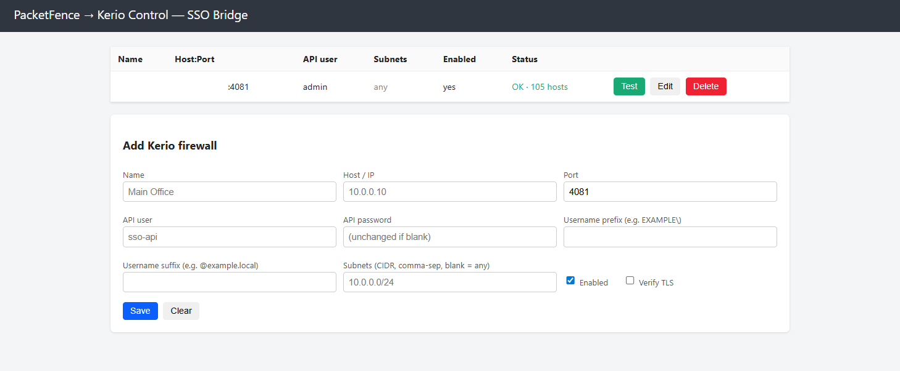

<p align="center">
  
</p>

# PacketFence → Kerio Control SSO Bridge

A small, self-contained service that turns **PacketFence**'s generic `JSONRPC`
Firewall SSO events into **Kerio Control** `ActiveHosts.login` / `ActiveHosts.logout`
API calls — giving you **per-username** firewall policy and logging on Kerio
Control, driven by your PacketFence (802.1X / captive portal) authentication.

Kerio Control is **not** a supported PacketFence firewall target. This bridge
fills that gap using PacketFence's generic JSON-RPC SSO module on one side and
the Kerio Control Administration API on the other.

```
PacketFence  --(JSON-RPC: Start / Update / Stop)-->  this bridge  --(Kerio API)-->  Kerio Control
   802.1X / captive portal                              :9090                         ActiveHosts.login/logout
```

## Features

- **Multiple Kerio firewalls**, managed from a built-in web GUI (add / edit / delete / **test**)
- Handles PacketFence `Start`, `Update`, and `Stop`
- Auto-detects which Kerio currently holds a device IP; optional per-Kerio subnet routing
- Per-Kerio username prefix/suffix for multi-domain `user@domain` setups
- HTTPS + HTTP Basic auth, runs as a non-root user in a tiny Alpine container
- Stateless except a small JSON store of your Kerio list
- No third-party Python dependencies (standard library only)

<p align="center">
  
</p>

## Requirements

- **Kerio must be the L3 gateway** for the user networks — a device must already
  appear in Kerio → *Status → Active Hosts* for the bind to attach to. If Kerio
  isn't in the traffic path, there's no host to bind (and no traffic to filter).
- **RADIUS accounting is required.** PacketFence learns each device's IP from
  accounting (it's what populates the IP it sends in the SSO event). Your NAS /
  controller (e.g. UniFi, switches, APs) **must** send RADIUS accounting
  (Acct-Start / Interim-Update / Acct-Stop, including `Framed-IP-Address`) to
  PacketFence. Without accounting, PacketFence has no IP to push and nothing
  binds. Interim-Update accounting is strongly recommended so re-binds keep
  happening as sessions continue.
- A Kerio Control **admin** account for the API (default port `4081`).
- PacketFence with the **JSONRPC** Firewall SSO module.
- Usernames sent by PacketFence must exist as Kerio users (ideally the same
  directory both systems authenticate against).
- Docker + Docker Compose on the host.

## Quick start (one command)

```bash
git clone https://github.com/abdlmalekluttee/packetfence-kerio-sso-bridge.git
cd packetfence-kerio-sso-bridge
sudo ./deploy.sh
```

`deploy.sh` prompts **only** for the GUI and PacketFence usernames/passwords.
Everything else is automatic: it writes `.env`, generates a self-signed TLS
cert (CN = the host's primary IP), fixes permissions for the non-root container
user, builds the image, and starts the container. When it finishes it prints the
GUI URL.

> Passwords must not contain spaces.

Open `https://<host>:9090/`, log in with the admin credentials you chose, add
your Kerio firewall(s), and click **Test**.

### Manual start (if you prefer not to use the script)

```bash
cp .env.example .env          # set BRIDGE_PASS and ADMIN_PASS (no spaces)
mkdir -p certs data
openssl req -x509 -newkey rsa:2048 -nodes \
  -keyout certs/bridge.key -out certs/bridge.crt \
  -days 825 -subj "/CN=$(hostname -I | awk '{print $1}')"
chown -R 10001:10001 data certs   # container runs as uid 10001
docker compose up -d --build
docker compose logs -f
```

## PacketFence configuration

**1. Enable iplog updates** so PacketFence knows each device's IP to send.
Configuration → System Configuration → **Advanced**, and turn on:
- **Update the iplog using the accounting** (required — this is the primary,
  reliable source of the device IP)
- **Update the iplog using the authentication**

**2. Make sure RADIUS accounting reaches PacketFence** from your NAS/controller
(UniFi, switches, APs), including `Framed-IP-Address`, with Interim-Update
enabled. This is what fills the IP that gets pushed to the bridge.

**3. Add the firewall:** Configuration → Integration → **Firewall SSO** →
**New Firewall** → **JSONRPC**. Set the host/port to this bridge and the
Basic-auth credentials to `BRIDGE_USER` / `BRIDGE_PASS`. PacketFence POSTs to
`/`; the management GUI is also at `/` (GET), so they share the one port.

> PacketFence sends `Start`, `Update`, and `Stop`. This bridge treats `Update`
> like `Start`, so periodic accounting updates keep re-binding the user — handy
> when a host appears in Kerio a little after authentication.

## Multi-domain (user@domain)

When Kerio is mapped to multiple directories, it identifies users as
`user@domain`. Make PacketFence send the **full UPN** (don't strip the realm),
and either leave the per-Kerio prefix/suffix blank (pass-through) or set them per
firewall.

## Environment variables

| Variable | Default | Purpose |
|---|---|---|
| `BRIDGE_USER` / `BRIDGE_PASS` | `packetfence` / `change-me` | Basic auth PacketFence presents to the JSON-RPC endpoint |
| `ADMIN_USER` / `ADMIN_PASS` | `admin` / `change-me-too` | Basic auth for the management GUI |
| `LISTEN_ADDR` / `LISTEN_PORT` | `0.0.0.0` / `9090` | Listener |
| `CERT_FILE` / `KEY_FILE` | `/certs/bridge.crt` `/certs/bridge.key` | TLS cert/key (omit to serve plain HTTP behind a reverse proxy) |
| `CONFIG_PATH` | `/data/kerios.json` | Where the Kerio list is persisted |
| `RETRY_TRIES` / `RETRY_DELAY` | `3` / `2` | Retry the Active-Hosts lookup (host may not be present the instant SSO fires) |

## Security notes

- **Kerio admin passwords are stored in plaintext** in `data/kerios.json`.
  Protect the host, restrict filesystem access, and use a dedicated Kerio admin
  account scoped as tightly as your environment allows.
- Always run behind TLS and set strong `BRIDGE_PASS` / `ADMIN_PASS`.
- Restrict who can reach port `9090` (PacketFence + admins only).
- The bridge does **not** verify Kerio's TLS certificate by default (Kerio's
  admin port often uses a self-signed cert). Enable per-Kerio "Verify TLS" if you
  have a trusted certificate.
- `.env`, `certs/`, and `data/` are git-ignored — never commit secrets or keys.

## Limitations

- Unofficial. Not affiliated with or endorsed by GFI/Kerio or the PacketFence project.
- Per-user enforcement only works for traffic that actually passes through Kerio.
- Tested against the Kerio Control 9.x Administration API.

## Credit

Built by **Luttei** with help from **Claude (Anthropic)**. Use at your own risk.

## License

MIT — see [LICENSE](LICENSE).
